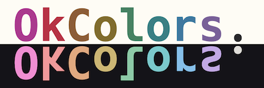
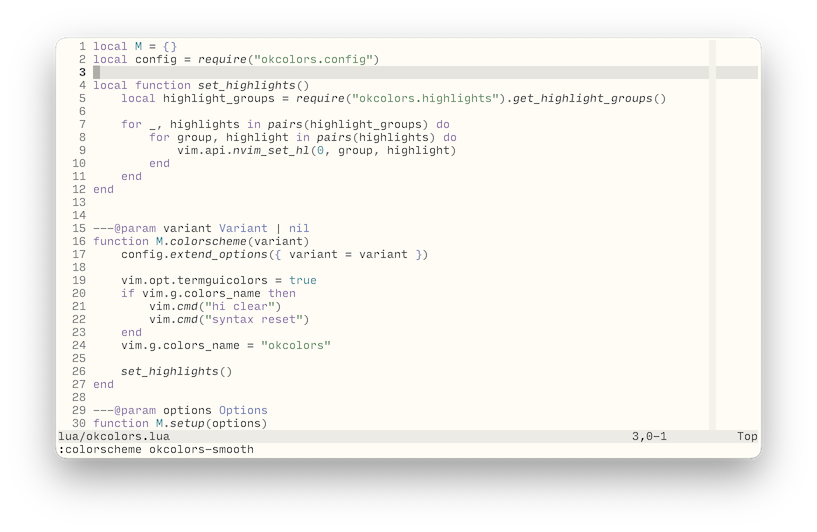
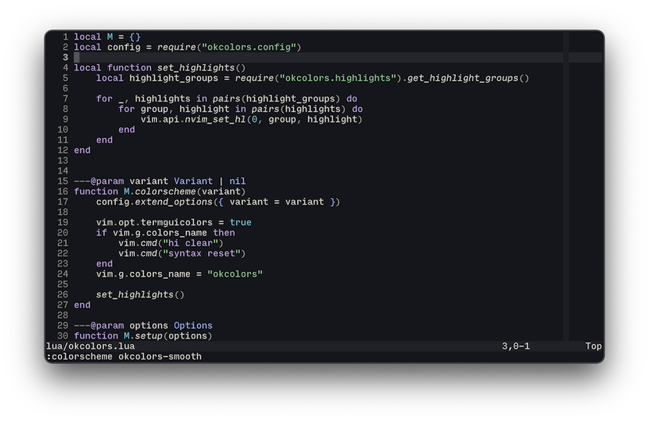
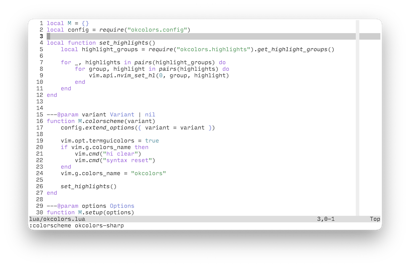
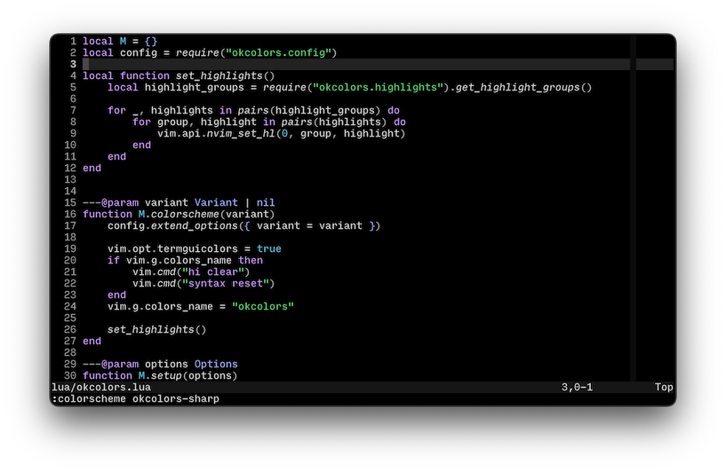

# OkColors.nvim



OkColors is a colorscheme that mashes together ideas from a variety of sources,
including:
- [The Munsell color system](https://en.wikipedia.org/wiki/Munsell_color_system) by
  Albert. Munsell
- [The Oklab color space](https://bottosson.github.io/posts/oklab/) by Björn Ottosson
- [Earl Grey](https://earl-grey.halt.wtf) by June Kelley
- [Flexoki](https://stephango.com/flexoki) by Steph Ango
- [Rosé Pine for NeoVim](https://github.com/rose-pine/neovim) by the Rosé Pine
  developers

Two variants are included:
- `okcolors-smooth` which uses fairly uniform saturation, excepting the red and magenta
  meant to catch the eye. All foreground/background combinations meet the draft WCAG 3
  contrast requirement for "fluently readable" text.
- `okcolors-sharp`, which employs darker black tones and deeper saturation for colored
  text where possible, while maintaining readable contrast requirements.

Each variant defines light and dark versions, which are automatically set according to
`vim.o.background`.

## Installation & Configuration

**Installing with lazy.nvim**

```lua
{ "e-q/okcolors.nvim", name = "okcolors" }
```

**Selecting the default variant**
```lua
require("okcolors").setup({
    variant = "smooth", -- "smooth" or "sharp", defaults to "smooth"
})

vim.cmd("colorscheme okcolors")
-- vim.cmd("colorscheme okcolors-smooth")
-- vim.cmd("colorscheme okcolors-sharp")
```

## Screenshots

### Smooth



### Sharp



## Other Helpful Resources

- [WCAG 2 Color Contrast Checker](https://www.siegemedia.com/contrast-ratio)
- [Draft WCAG 3 Color Contrast Checker](https://cliambrown.com/contrast/)
- [Okhsv & Okhsl Color Pickers](https://bottosson.github.io/misc/colorpicker)
- [OKLCH Color Picker & Converter](https://oklch.com)
